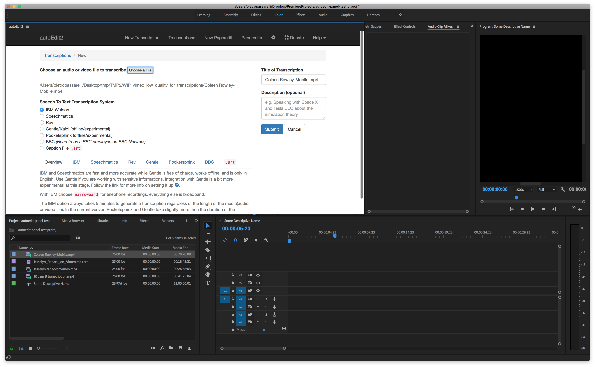

# Import media

To create a new transcription, click on the media in the Adobe Premiere Project Panel,  and then click  `Choose a File` in the Adobe Premiere Panel. 

The rest of the instructions are the same as the regular autoEdit, see [relevant section of user manual](../transcribing/#adding-a-videoaudio).

\_\_


Sign up to the [mailing list](http://eepurl.com/cMzwSX), follow on [twitter](http://twitter.com/autoEdit2) and/or [facebook](https://www.facebook.com/autoEdit.io/) to keep up to date with the latest releases. Say hi at [pietro@autoEdit.io](mailto:pietro@autoEdit.io?Subject=Hello), always curious to hear what autoEdit is helping you with.


