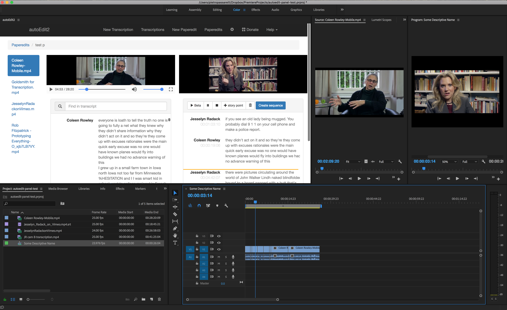

# Paper-edit to sequence

Clicking `create sequence` in the panel inserts the paper-edit selections in a Premiere sequence.

There's a prompt to ask if you want to add to current sequence, or create a new sequence.

If adding to current sequence, it adds at the position of the playhead in the sequence. 

