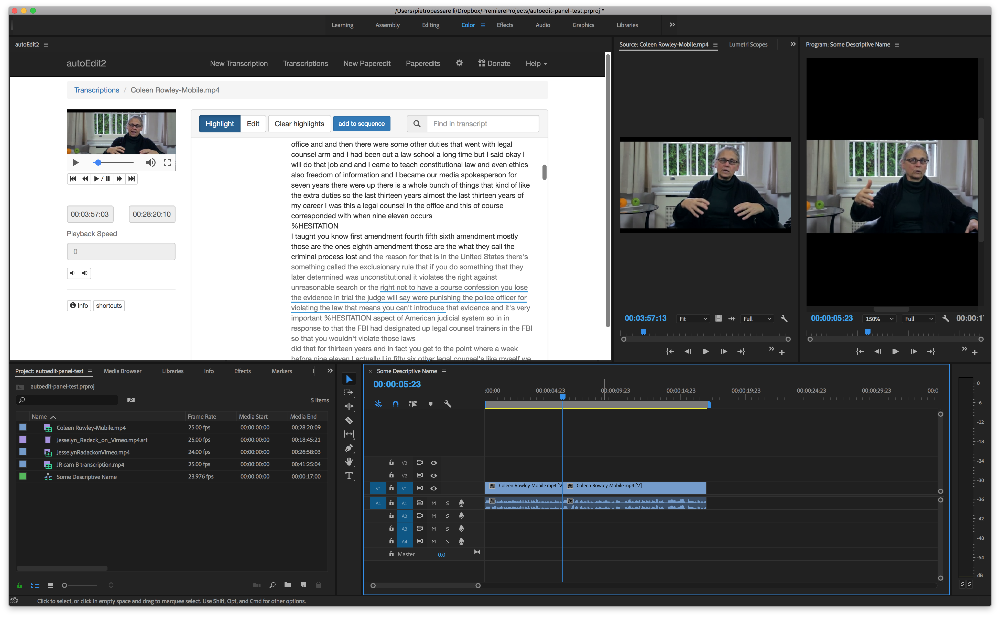

# Transcription export selections

In the panel click `add to sequence` to add all the selection highlights from one transcription to the current Adobe's Premiere active sequence as they appear in the transcription in chronological order.

There's a prompt to ask if you want to add to current sequence, or create a new sequence.

If adding to current sequence, it adds at the position of the playhead in the sequence.   

