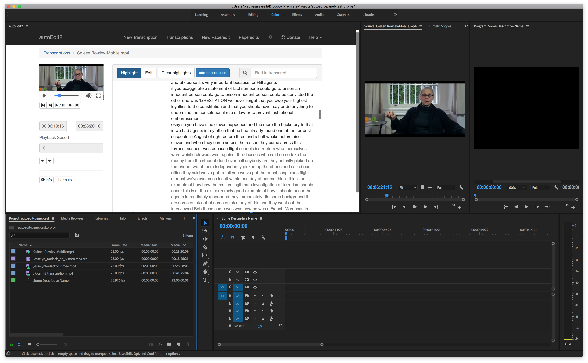

# Transcription to source monitor

clicking on word in transcription open clip in source monitor with playhead at corresponding timecode.

It does not autoPlay. In Premiere you can use shortcut to play/pause the clip in the monitor.

You can also use Premiere's shortcut `cmd`+ `i` and `cmd` + `o` to set in and out point in the source monitor. 

and then can use `cmd` + `.` and `cmd` + `,` to insert or overwrite  in an active Premiere sequence.

\_\_


Sign up to the [mailing list](http://eepurl.com/cMzwSX), follow on [twitter](http://twitter.com/autoEdit2) and/or [facebook](https://www.facebook.com/autoEdit.io/) to keep up to date with the latest releases. Say hi at [pietro@autoEdit.io](mailto:pietro@autoEdit.io?Subject=Hello), always curious to hear what autoEdit is helping you with.


