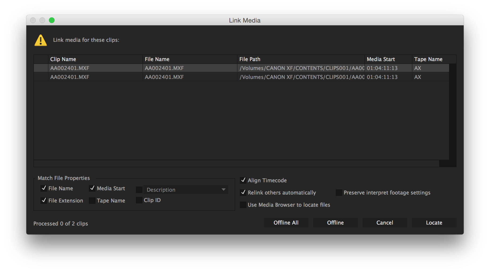

# Opening EDL in video editing software

EDL is compatible with all major editing software.

* Adobe Premiere
* Avid Media Composer
* Final Cut Pro 7
* [DaVinci resolve](https://www.blackmagicdesign.com/products/davinciresolve) \(it has a free version\) 
* And any other editing software that lets you import an EDL file…

To import the EDL and reconnect the sequence

1. Import the EDL
2. Go to the sequence
3. Reconnect the offline sequence
4. Continue your editing

## Adobe Premiere example {#adobe-premiere-example}

## Davinci Resolve - 15



1. Got to `File` --&gt;  `Import Timeline` --&gt; `Import AFF, EDL, XML ...`
2. Select your EDL file
3. Add sequence settings if needed 
4. If you have your clip in the `Media Pool` it should automatically reconnect the sequence, if you have no clips in the Media Pool it might complain and note let you import the EDL. Otherwise if the right clip are not in the media pool, you  might  need to reconnect them to the original. See Davinci Resolve user manual for how.

## **a Note on working with Final cut pro X**

For now a workaround for Final cut pro X not supporting EDL is that you can open the EDL in [Davinci resolve](https://www.blackmagicdesign.com/products/davinciresolve) convert it to XML that will work with final cut X.

## Align timecode in Premiere

In adobe premiere there is an option to `align timecode`The Align Timecode option is also checked by default to align the media file's source timecode to the clip being linked.

From __[_Relink offline media_ adobe website](https://helpx.adobe.com/premiere-pro/using/relinking-media.html)

This option can be useful if you imported in autoEdit footage directly from a camcorder that might have camera time codes offsets \(eg rec run, time of the day, free run etc..\) as autoEdit would read the metadata of the file and calculate the offset for you automatically.  

\_\_


Sign up to the [mailing list](http://eepurl.com/cMzwSX), follow on [twitter](http://twitter.com/autoEdit2) and/or [facebook](https://www.facebook.com/autoEdit.io/) to keep up to date with the latest releases. Say hi at [pietro@autoEdit.io](mailto:pietro@autoEdit.io?Subject=Hello), always curious to hear what autoEdit is helping you with.



[autoEdit.io](http://www.autoEdit.io) it's free and open source. Free as in free speech as well as in free beer. [Help support the autoEdit project to keep it that way](https://donorbox.org/c9762eef-0e08-468e-90cb-2d00643697f8?recurring=true). Support will go towards fixing bugs, adding features, provide support for users etc...


