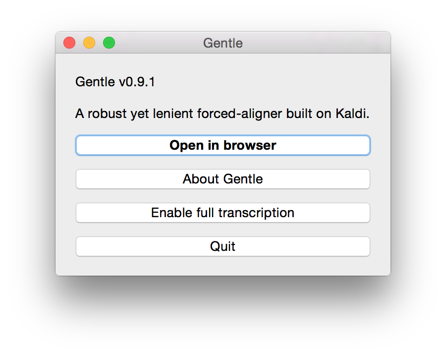
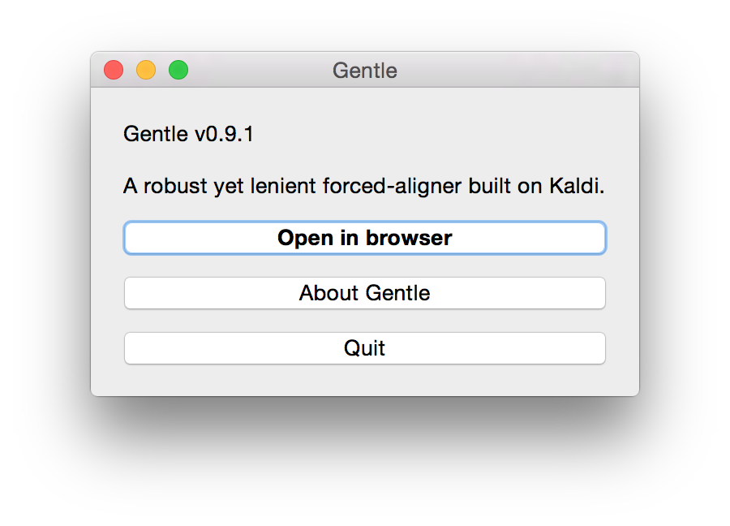
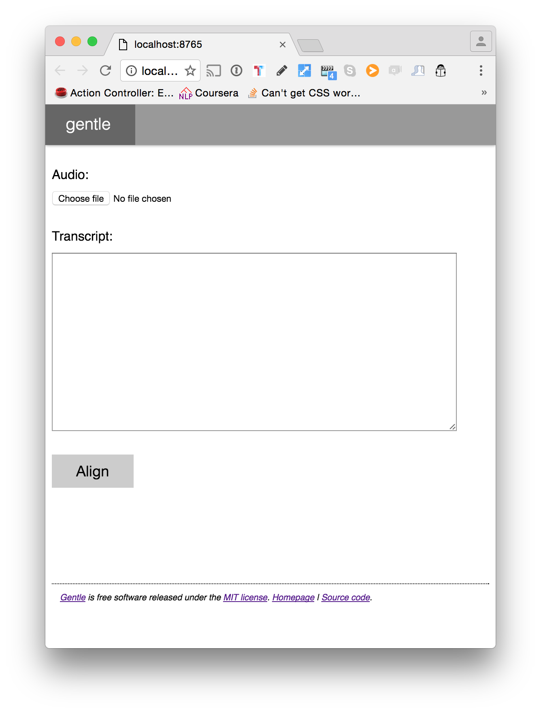

# Setup: STT APIs - Gentle

## First time setup

To use autoEdit with Gentle, an open source offline speech to text service, you need to download a separate app to run alongside autoEdit2 on your mac. The first time you launch Gentle it will download the language model to work offline.

* 1.Download Gentle
  * [Gentle Version `0.10.1`](https://github.com/lowerquality/gentle/releases/tag/0.10.1). This is the recommended version as it is the latest and most stable. But it is not backward compatible with OS X versions preceding Sierra.
  * [Gentle version `0.9.1`](https://github.com/lowerquality/gentle/releases/tag/0.9.1) about`104mb`. It's buggy in the alignment of the transcription, but is compatible with earlier versions of Mac Os X. Download this only if you don't have OS X Sierra or later, and don't intend to upgrade your OS any time soon.
* 2.Start the Gentle app by double clicking on it.
* 3.Click`Enable full transcription`, this will download the language model component to be able to work offline.

* 4.restart the Gentle app
* 5.the Gentle server is now up and running.

From now on, you just need to launch Gentle and check local host is working.

## Launching Gentle’s local server

If you've already done the initial setup, downloading the language model as described above, all you need to do when using Gentle is click `open in browser`.

This will open your default browser with this page, and this means the Gentle server is running locally. The address should be [http://localhost:8765](http://localhost:8765]%28http://localhost:8765\).

Now you are ready to chose Gentle as an option when adding a new transcription. Go back to the [user manual](../transcribing/) to continue.

\_\_


Sign up to the [mailing list](http://eepurl.com/cMzwSX), follow on [twitter](http://twitter.com/autoEdit2) and/or [facebook](https://www.facebook.com/autoEdit.io/) to keep up to date with the latest releases. Say hi at [pietro@autoEdit.io](mailto:pietro@autoEdit.io?Subject=Hello), always curious to hear what autoEdit is helping you with.



[autoEdit.io](http://www.autoEdit.io) it's free and open source. Free as in free speech as well as in free beer. [Help support the autoEdit project to keep it that way](https://donorbox.org/c9762eef-0e08-468e-90cb-2d00643697f8?recurring=true). Support will go towards fixing bugs, adding features, provide support for users etc...


