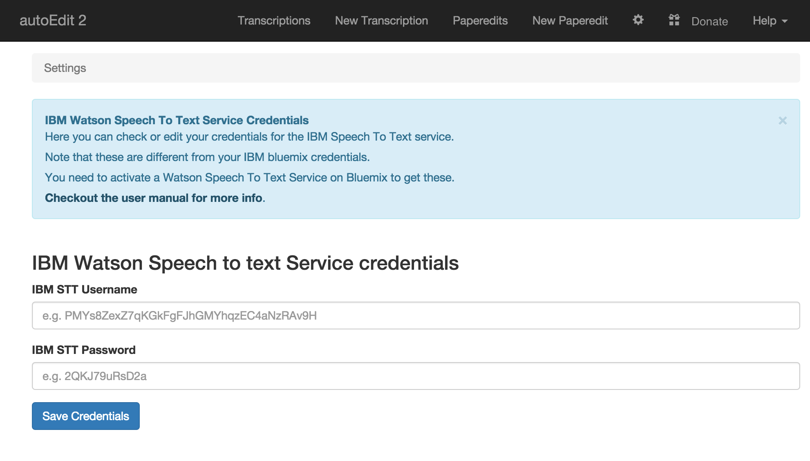

# Setup: STT APIs - IBM

## GET IBM Bluemix Speech To Text API Keys {#get-ibm-bluemix-speech-to-text-api-keys}

Here to[get API keys for IBM Bluemix Watson Speech To Text service](https://console.ng.bluemix.net/catalog/services/speech-to-text)

_Not that after you have made your IBM Bluemix account you need the IBM Watson Speech to text credentials for autoEdit._ 

[**Here is an unofficial guide to get the IBM Bluemix Speech to text credentials**](https://docs.google.com/document/d/1P9GQayzmoRHaDK_p4jPdMChfvQNCzmjQTNWmXFXkOiY/edit?usp=sharing)

## Add the API keys to the app at startup {#add-the-api-keys-to-the-app-at-startup}


Important, this page is out of date, and will need to be updated at some point, for now follow [these instruction ](https://github.com/OpenNewsLabs/autoEdit_2/pull/50)


When you first launch the app by double clicking on it you are taken to the credentials page. Where you can add IBM Watson Speech to text service username and password API keys.

_Note that these are not your IBM Bluemix credentials, but you have to create a speech to text service within Bluemix and get those credentials._

## Click on `Save Credentials`

Click on `Save Credentials` and that’s it. You are ready to go.

Visit the credentials page to review or change the API keys.

Now you are ready to chose IBM as an option [when adding a new transcription](../transcribing/). Checkout the[ transcribing section of the user manual](../transcribing/) to see how to do that.

\_\_


Sign up to the [mailing list](http://eepurl.com/cMzwSX), follow on [twitter](http://twitter.com/autoEdit2) and/or [facebook](https://www.facebook.com/autoEdit.io/) to keep up to date with the latest releases. Say hi at [pietro@autoEdit.io](mailto:pietro@autoEdit.io?Subject=Hello), always curious to hear what autoEdit is helping you with.



[autoEdit.io](http://www.autoEdit.io) it's free and open source. Free as in free speech as well as in free beer. [Help support the autoEdit project to keep it that way](https://donorbox.org/c9762eef-0e08-468e-90cb-2d00643697f8?recurring=true). Support will go towards fixing bugs, adding features, provide support for users etc...


