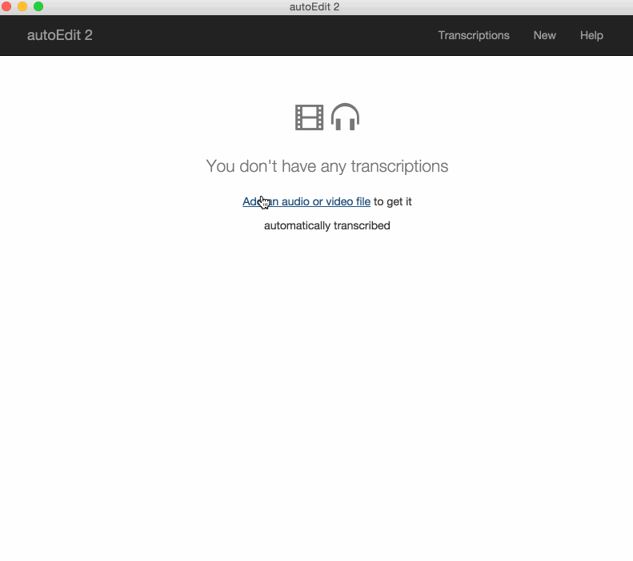
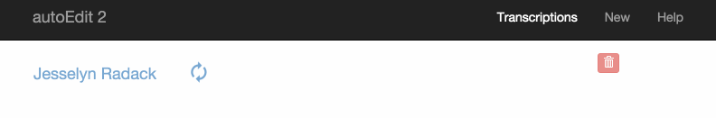
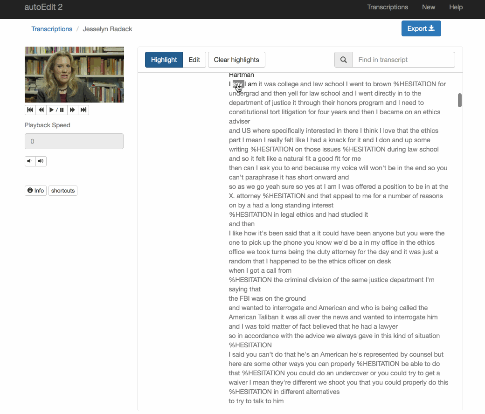
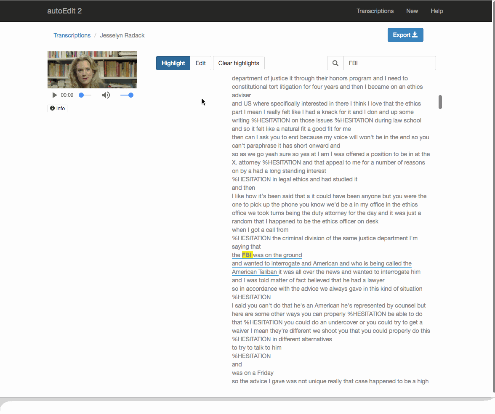

# Transcriptions

If this is your first time using the tool go ahead and [setup the STT API system first](../setup-stt-apis/).

## 1. Adding a video/audio 

1. Click on `new`
2. Choose the media you want to open, audio or video.
3. Fill in title and description
4. Chose Speech To Text \(STT\) system you want to use \(IBM American English is the default\)
5. `Save Transcription`

[For a list of supported media file type see ffmpeg\(which is what has been used for the file conversion under the hood\)](https://ffmpeg.org/general.html#Supported-File-Formats_002c-Codecs-or-Features)

If you stick with the IBM default, the transcription will take around **5 minutes** process regardless of the length of the media.

_\*\*_to

## 2. Selecting text from a transcription 

If you click on a word, the video starts playing from that point.  
Make a selections of text you’d like to include in your video sequence.

## 3. Exporting a video sequence\(EDL\) 

Export an EDL, which is an [Edit decision list](https://en.wikipedia.org/wiki/Edit_decision_list).

You can export a video sequence of selection as they appear chronologically in the video.

### Other export options

There are other export options such as plain text or timecode text, as well as `srt` captions.

### Note on Paper-editing

If you want to work with more elaborate selections pulling from multiple transcriptions, deciding the order to craft it into a story script [check out the paper-editing section.](../paperediting.md)

## 4. Reconnect in video editing software of choice 

[Checkout this section on how to open an EDL](../opening-edl-in-video-editing-software.md) in a video editing software of choice to get a video sequence of your selections.

\_\_


Sign up to the [mailing list](http://eepurl.com/cMzwSX), follow on [twitter](http://twitter.com/autoEdit2) and/or [facebook](https://www.facebook.com/autoEdit.io/) to keep up to date with the latest releases. Say hi at [pietro@autoEdit.io](mailto:pietro@autoEdit.io?Subject=Hello), always curious to hear what autoEdit is helping you with.



[autoEdit.io](http://www.autoEdit.io) it's free and open source. Free as in free speech as well as in free beer. [Help support the autoEdit project to keep it that way](https://donorbox.org/c9762eef-0e08-468e-90cb-2d00643697f8?recurring=true). Support will go towards fixing bugs, adding features, provide support for users etc...


